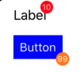

# Badgeable

Bedgeable is a protocol can display badge into your any custom UI components or even apply all UIView.



## Installation

### Swift Package Manager

Xcode

File > Swift Packages > Add Package Dependency

Enter `https://github.com/millenagm/Badgeable.git` in the "Choose Package Repository" dialog.

### Manually

If you prefer to install manually.

- Drop `Badgeable.swift` file into your Xcode project.

## Usage

Conform `Badgeable` protocol where you want to display badge.
Then you can display badge by setting `badgeCount` property.

```swift
class CustomButton: UIButton, Badgable { }
```

or by extension

```swift
extension UIView: Badgeable {}
```

You can change the appearance.

```swift
view.badgeCount = 6
view.maxValue = 5 // will show (5+)
view.badgeColor = .orange
view.badgePosition = .topRight
```
